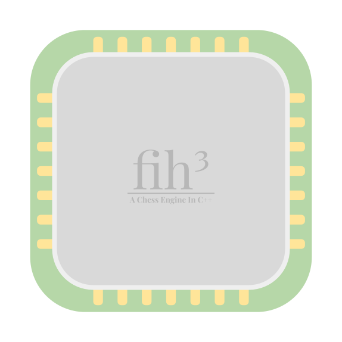

  

<h1 align="center">fih³</h1>

## Stupid Ahh Chess Engine Im making In C++

---

## Todo List
1.  Bitboards for board representation 🟩
2.  32-bit move encoding 🟩
3.  Templated move generator 🟨
4.  Alpha-beta negamax search 🟩
5.  Transposition tables 🟥
6.  Quiescence search
7.  Move ordering
8.  Search extensions
9.  Pruning
10. Late move reductions
11. Internal iterative reductions
12. Razoring
13. Principal variation search
14. Iterative deepening
15. Lazy SMP threading
16. Raw hand crafted eval
17. NNUE (maybe sometime later)

🟩 = Done, fully optimized as much as needed

🟨 = Not sure if it is as optimized as it can be

🟥 = Needs a lot of work